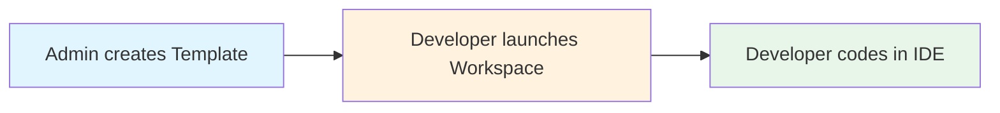

# Quickstart

**Keywords:** quickstart, first workspace, templates, workspaces, users

Get your first Coder development environment running in under 10 minutes. This guide covers the essential concepts and walks you through creating your first workspace and running VS Code from it.

## What You'll Build

In this quickstart, you'll:
- ✅ Install Coder server
- ✅ Create a **template** (blueprint for dev environments)
- ✅ Launch a **workspace** (your actual dev environment)
- ✅ Connect from your favorite IDE

## Understanding Coder: 30-Second Overview

Before diving in, here are the three concepts that power Coder:

| Component | What It Is | Real-World Analogy |
|-----------|------------|-------------------|
| **Templates** | A Terraform blueprint that defines your dev environment (OS, tools, resources) | Recipe for a meal |
| **Workspaces** | The actual running environment created from the template | The cooked meal |
| **Users** | A developer who launches the workspace from a template and does their work inside it | The people eating |



**First time here?** Coder separates how an environment is defined (Admin’s job) from where you do your day-to-day coding (Developer’s job). As a developer, you’ll use templates to launch workspaces, and as an admin, you’ll create and manage those templates for others.

## Prerequisites

- A machine with 2+ CPU cores and 4GB+ RAM
- Docker installed ([Install Docker](https://docs.docker.com/get-docker/))
- 10 minutes of your time

## Step 1: Install Coder (2 minutes)

Choose your platform:

<details>
<summary><b>macOS/Linux</b></summary>

```bash
# Install the Coder CLI
curl -L https://coder.com/install.sh | sh

# Verify installation
coder version
```

</details>

<details>
<summary><b>Windows</b></summary>

```powershell
# Using winget
winget install Coder.Coder

# Or download from
# https://github.com/coder/coder/releases
```

</details>

## Step 2: Start Coder Server (1 minute)

```bash
# Start Coder (runs on http://localhost:3000)
coder server

# Your terminal shows:
# ✓ Started HTTP listener at http://localhost:3000
# ✓ View the Web UI: http://localhost:3000
```

> **Tip:** Coder automatically opens your browser. If not, go to [http://localhost:3000](http://localhost:3000)

## Step 3: Initial Setup (2 minutes)

1. **Create your admin account:**
   - Username: `yourname` (lowercase, no spaces)
   - Email: `your.email@example.com`
   - Password: Choose a strong password
  
	You can also choose to **Continue with GitHub** instead of creating an admin account

   

3. **You'll land on the Workspaces page** (it's empty - that's normal!)

## Step 4: Create Your First Template (2 minutes)

Templates define what's in your development environment. Let's start simple:

1. Click **"Templates"** → **"Create Template"**

2. **Choose a starter template:**
   
   | Starter | Best For | Includes |
   |---------|----------|----------|
   | **Docker** (Recommended) | Local development | Ubuntu, common tools |
   | **Kubernetes** | Cloud-native teams | K8s pod deployment |
   | **AWS EC2** | Cloud resources | EC2 instance |

3. Click **"Use template"** on **Docker**

4. **Name your template:**
   - Name: `quickstart`
   - Display name: `quickstaet doc template`
   - Description: `Provision Docker containers as Coder workspaces`
  


5. Click **"Create template"**

**What just happened?** You defined a template — a reusable blueprint for dev environments — in your Coder deployment. It’s now stored in your organization’s template list, where you and any teammates in the same org can create workspaces from it. Let’s launch one.

## Step 5: Launch Your Workspace (2 minutes)

1. After template creation, click **"Create Workspace"**

2. **Name your workspace:**
   - Name: `my-first-workspace`

3. Click **"Create Workspace"**

4. **Watch it spin up** (takes ~30 seconds)
   - Status changes: `Pending` → `Starting` → `Running` ✅

## Step 6: Connect Your IDE (1 minute)

Once your workspace shows `Running`:

<details>
<summary><b>VS Code</b> (Recommended for first-time)</summary>

1. Click **"VS Code Desktop"** button
2. Install the Coder extension when prompted
3. VS Code opens and connects automatically

</details>

<details>
<summary><b>JetBrains IDEs</b></summary>

1. Install [JetBrains Gateway](https://jetbrains.com/)
2. Click **"JetBrains Gateway"** in your workspace
3. Follow the connection flow

</details>

<details>
<summary><b>Web Terminal</b></summary>

1. Click **"Terminal"** in your workspace
2. You're now in a browser-based shell

</details>

<details>
<summary><b>SSH</b></summary>

```bash
# Configure SSH
coder config-ssh

# Connect
ssh coder.my-first-workspace
```

</details>


## ✅ Success! You're Coding in Coder

You now have:
- **Coder server** running locally
- **A template** defining your environment
- **A workspace** running that environment
- **IDE access** to code remotely

### Try This Now

In your connected IDE:

```bash
# You're inside your workspace container!
echo "Hello from $(hostname)"

# Check your environment
python3 --version
node --version
git --version

# Create a project
mkdir my-project && cd my-project
echo "# Built with Coder" > README.md
```

## What's Next?

Based on your role, here are your next steps:

### For Developers
- 📖 [Using workspaces](https://coder.com/docs/user-guides/workspace-management)
- 🔧 [Personalizing with dotfiles](https://coder.com/docs/user-guides/workspace-dotfiles)
- 💻 [Setting up AI Agents](https://coder.com/docs/ai-coder)

### For Admins
- 🎨 [Managing Templates](https://coder.com/docs/admin/templates/managing-templates)
- 👥 [Setting up your Organization](https://coder.com/docs/admin/users/organizations)

### For Teams
- 📦 [Administration Overview](https://coder.com/docs/admin)
- 📊 [Monitor usage](https://coder.com/docs/admin/monitoring)

## Quick Reference

### Common Commands

```bash
coder server              # Start Coder server
coder login <url>         # Connect to remote Coder
coder workspaces list     # List your workspaces
coder ssh <workspace>     # SSH into workspace
coder stop <workspace>    # Stop workspace (save resources)
```

## Troubleshooting

<details>
<summary><b>Docker connection error</b></summary>

```bash
# Error: Cannot connect to Docker daemon
# Fix: Ensure Docker is running
sudo systemctl start docker
# or
open -a Docker  # macOS
```

</details>

<details>
<summary><b>Port 3000 already in use</b></summary>

```bash
# Use a different port
coder server --http-address 0.0.0.0:8080
```

</details>

<details>
<summary><b>Can't access web UI</b></summary>

Check firewall settings and ensure port 3000 is accessible. For remote servers, use the tunnel URL shown in terminal output.

</details>

---

**Need help?** Join our [Discord](https://discord.gg/coder) or check [detailed installation docs](../install).
